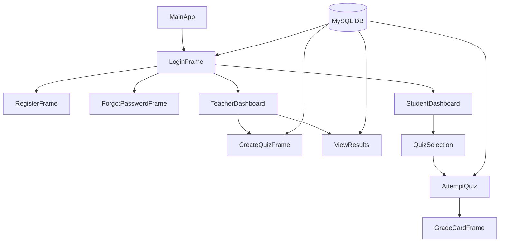

# 🚀 Online Examination System

### 🧠 Smart • Secure • Desktop-Based Exam Platform

<p align="center">
  
  

  
</p>

---

## 📌 Overview

The **Online Examination System** is a Java Swing-based desktop application designed to digitize the examination process with a focus on:

* 🔐 Secure authentication
* 🧠 Smart quiz engine
* 🎨 Modern UI system
* 📊 Real-time evaluation

The system supports **two roles**:

* 👨‍🏫 Teacher → Create quizzes & view results
* 🎓 Student → Attempt quizzes & view scores

---

## ✨ Core Features 

### 🔐 Authentication System

* Login system using database validation
* Role-based routing (Teacher / Student)
* Password masking + show/hide toggle
* Forgot password reset system

---

### 👨‍🏫 Teacher Module

#### ✅ Create Quiz

* Set quiz title & time limit
* Add multiple questions dynamically
* Store questions in database


---

#### 📊 View Results (Leaderboard)

* Rank-based leaderboard
* Search functionality
* Export results to CSV


---

### 🎓 Student Module

#### 📋 Quiz Selection

* View available quizzes
* Prevent multiple attempts
* Dynamic dropdown with teacher names

---

#### 🧠 Quiz Attempt Engine

* ⏱ Timer-based exam (`javax.swing.Timer`)
* 🔄 Answer backtracking (Previous button)
* 💾 State tracking using `selectedAnswers[]`
* 🔀 Dynamic navigation (Next → Submit)


---

#### 📊 Grade Card

* Percentage calculation
* Pass/Fail detection
* Student, quiz & teacher info from DB


---

## 🎨 UI System 

* Fully centralized styling system
* Indigo-themed modern UI
* Hover effects on buttons
* Responsive layouts using `GridBagLayout`


---

## 🗄️ Database Integration

* MySQL database connection using JDBC
* Singleton-like connection handling

```sql
Database: online_exam

Tables:
- users(user_id, username, password, role)
- quizzes(quiz_id, title, created_by, time_limit)
- questions(question_id, quiz_id, options, correct_option)
- results(result_id, student_id, quiz_id, score)
```

---

## 🏗️ System Architecture 



---

## 📁 Project Structure 

```bash
exam/
│
├── MainApp.java
├── DBConnection.java
├── UIStyle.java
│
├── LoginFrame.java
├── RegisterFrame.java
├── ForgotPasswordFrame.java
│
├── TeacherDashboard.java
│   ├── CreateQuizFrame.java
│   └── ViewResults.java
│
├── StudentDashboard.java
│   └── QuizSelection.java
│       └── AttemptQuiz.java
│           └── GradeCardFrame.java
```

---

## ⚙️ How to Run

### 1️⃣ Setup Database

* Create database: `online_exam`
* Import tables manually or via SQL

### 2️⃣ Update Credentials

Edit in:

```java
DBConnection.java
```

```java
"jdbc:mysql://localhost:3306/online_exam",
"root",
"root"
```

---

### 3️⃣ Run Project

```bash
javac exam/*.java
java exam.MainApp
```


---

## 🔥 Key Highlights

* 🧠 Real-time quiz engine with timer
* 🔄 Backtracking + state management
* 📊 Leaderboard + CSV export
* 🎨 Custom UI framework (rare in student projects)
* 🔐 Role-based authentication system
* 🗄️ Proper DB integration using JDBC

---

## ⚠️ Current Limitations 

* Passwords stored in plain text (no hashing)
* Desktop-only (no web/mobile support)
* No admin panel

---

## 🔮 Future Improvements

* 🔒 Password hashing (BCrypt)
* 🌐 Web version (Spring Boot + React)
* 📊 Analytics dashboard
* ☁️ Cloud database (Firebase/AWS)

---

## 👨‍💻 Developer

**Divyansh Kumar Singh** |
**Arnav Jain** | 
**Aadithya Sai PV** | 
**Aastha** | 


---

